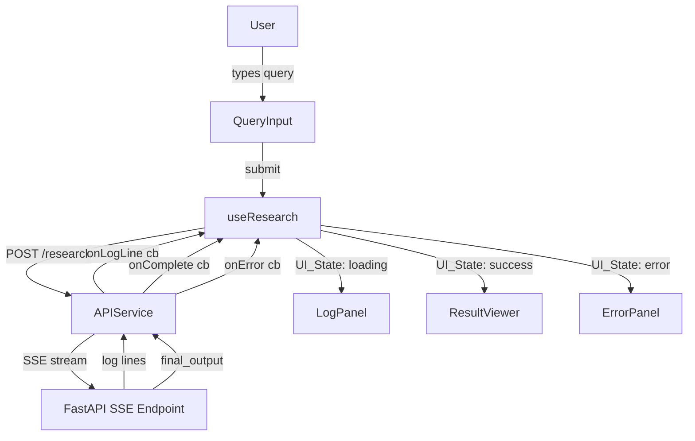

# Design Document: Multi-Agent Research Platform UI

## Overview

A production-ready React SPA that serves as the frontend for a FastAPI/LangGraph multi-agent research backend. The UI orchestrates four distinct states (`idle`, `loading`, `success`, `error`) and streams real-time agent logs via SSE/WebSocket. The design philosophy is "calm, intelligent AI thinking in real-time" — minimal visual noise, purposeful motion, and high readability.

The frontend is a pure client-side React app (no SSR) that communicates with the FastAPI backend through a dedicated API service layer. All streaming is handled via SSE (primary) with WebSocket as an alternative. The app is fully theme-aware (light/dark) using Tailwind's class-based dark mode strategy.

---

## Architecture

### High-Level Data Flow



### Routing Strategy

Single-page app with React Router v6. Two top-level routes:

| Route | Component | Guard |
|-------|-----------|-------|
| `/auth` | `AuthPage` | Redirect to `/` if authenticated |
| `/` | `Dashboard` | Redirect to `/auth` if not authenticated |

Auth state is stored in `localStorage` (token) and managed by an `AuthContext`. On first load, the app checks for a token and routes accordingly.

### State Management

No external state library (Redux/Zustand) is needed. State is managed at two levels:

1. **Global (React Context)**
   - `AuthContext` — current user, token, login/logout actions
   - `ThemeContext` — current theme (`light`/`dark`), toggle action

2. **Local (component/hook state)**
   - `useResearch` hook — owns `UI_State`, `logLines`, `agentState`, `currentQuery`
   - `useSessions` hook — owns session history list, active session ID
   - `AuthPage` — form state, validation errors, active tab

---

## Components and Interfaces

### Component Hierarchy

```
App
├── AuthContext.Provider
├── ThemeContext.Provider
└── Router
    ├── /auth → AuthPage
    │   ├── BrandingPanel
    │   └── AuthFormPanel
    │       ├── TabSwitcher (Login | Sign Up)
    │       ├── LoginForm
    │       │   ├── EmailInput
    │       │   ├── PasswordInput
    │       │   └── GoogleOAuthButton
    │       └── SignUpForm
    │           ├── EmailInput
    │           ├── PasswordInput
    │           ├── ConfirmPasswordInput
    │           └── GoogleOAuthButton
    └── / → Dashboard
        ├── Sidebar
        │   ├── NewResearchButton
        │   ├── SessionList
        │   │   └── SessionItem (×n)
        │   └── UserProfile
        ├── ThemeToggle
        └── MainArea
            ├── [idle]   → QueryInput
            ├── [loading] → LogPanel
            ├── [success] → ResultViewer
            │               └── FloatingActionBar
            └── [error]  → ErrorPanel
```

### Key Component Interfaces

```typescript
// UI state machine
type UIState = 'idle' | 'loading' | 'success' | 'error';

// Matches backend AgentState schema
interface AgentState {
  user_query: string;
  subqueries: string[];
  raw_data: string[];
  final_output: string;
  review_decision: string;
  review_feedback: string;
  revision_count: number;
}

// A persisted research session
interface Session {
  id: string;
  query: string;
  result: string;        // final_output markdown
  createdAt: string;     // ISO timestamp
  agentState: AgentState;
}

// Streaming event types from SSE
type StreamEvent =
  | { type: 'log'; line: string }
  | { type: 'complete'; agentState: AgentState }
  | { type: 'error'; message: string };

// useResearch hook return shape
interface UseResearchReturn {
  uiState: UIState;
  logLines: string[];
  agentState: AgentState | null;
  currentQuery: string;
  startResearch: (query: string) => void;
  resetToIdle: () => void;
  loadSession: (session: Session) => void;
}

// Props interfaces
interface LogPanelProps {
  lines: string[];
  isLoading: boolean;
}

interface ResultViewerProps {
  markdown: string;
  onNewResearch: () => void;
}

interface ErrorPanelProps {
  message: string;
  previousQuery: string;
  onRetry: () => void;
}

interface SessionItemProps {
  session: Session;
  isActive: boolean;
  onClick: (session: Session) => void;
}
```

---

## Data Models

### API Service Layer

All backend communication is isolated in `src/services/researchApi.ts`:

```typescript
// src/config/api.ts
export const API_BASE_URL = import.meta.env.VITE_API_BASE_URL ?? 'http://localhost:8000';

// src/services/researchApi.ts
interface StreamCallbacks {
  onLog: (line: string) => void;
  onComplete: (agentState: AgentState) => void;
  onError: (message: string) => void;
}

function streamResearch(query: string, callbacks: StreamCallbacks): () => void {
  // Returns a cleanup/abort function
  // Primary: SSE via EventSource
  // Fallback: simulated streaming if connection fails
}
```

### Session Persistence

Sessions are stored in `localStorage` under the key `research_sessions` as a JSON array of `Session` objects. The `useSessions` hook manages CRUD operations on this array.

### Theme Persistence

Theme preference is stored in `localStorage` under `theme`. On mount, `ThemeContext` reads this value and applies the `dark` class to `document.documentElement` if needed.

### Mock Streaming Data

When the real endpoint is unavailable, `researchApi.ts` falls back to a mock sequence:

```typescript
const MOCK_LOG_LINES = [
  '--- PLANNER AGENT RUNNING ---',
  'Breaking query into sub-queries...',
  '--- RESEARCHER AGENT RUNNING ---',
  'Searching for: sub-query 1...',
  'Searching for: sub-query 2...',
  '--- WRITER AGENT RUNNING ---',
  'Synthesizing final report...',
  '--- REVIEWER AGENT RUNNING ---',
  'Review Decision: PASS',
];
```

Lines are emitted at 400ms intervals. After the last line, a mock `AgentState` with placeholder markdown is emitted as the `complete` event.

---

## Animation System

All animations use Framer Motion. The design constraint is: duration 150ms–300ms, easing `ease-out` or `ease-in-out`, no bounce/spring, never blocking interaction.

### Animation Variants Library (`src/lib/animations.ts`)

```typescript
export const fadeUpVariant = {
  hidden: { opacity: 0, y: 10 },
  visible: { opacity: 1, y: 0, transition: { duration: 0.3, ease: 'easeOut' } },
};

export const fadeVariant = {
  hidden: { opacity: 0 },
  visible: { opacity: 1, transition: { duration: 0.2, ease: 'easeOut' } },
};

export const scaleInVariant = {
  hidden: { opacity: 0, scale: 0.98 },
  visible: { opacity: 1, scale: 1, transition: { duration: 0.3, ease: 'easeInOut' } },
};

export const logLineVariant = {
  hidden: { opacity: 0, y: 5 },
  visible: { opacity: 1, y: 0, transition: { duration: 0.2, ease: 'easeOut' } },
};

export const staggerContainer = {
  visible: { transition: { staggerChildren: 0.05 } },
};

// Button press: applied via whileTap on motion.button
export const buttonTap = { scale: 0.97 };
export const buttonHover = { scale: 1.02 };
export const actionButtonHover = { scale: 1.05 };
```

### Animation Usage Map

| Component | Trigger | Variant | Duration |
|-----------|---------|---------|----------|
| `AuthPage` | mount | `fadeUpVariant` | 300ms |
| `AuthFormPanel` tab switch | tab change | `fadeVariant` | 150ms |
| `MainArea` state change | `AnimatePresence` | `fadeUpVariant` | 300ms |
| `LogPanel` new line | append | `logLineVariant` | 200ms |
| `ResultViewer` | mount | `scaleInVariant` | 300ms |
| `ResultViewer` content blocks | mount | `staggerContainer` + `fadeUpVariant` | 50ms stagger |
| `FloatingActionBar` | mount | `fadeUpVariant` (y: 8px) | 250ms |
| `ErrorPanel` | mount | `fadeUpVariant` | 300ms |
| `SessionItem` hover | hover | CSS transition | 150ms |
| Submit button | tap | `buttonTap` (scale 0.97) | 100ms |

`AnimatePresence` wraps the `MainArea` content switcher so exiting components animate out before entering ones animate in.

---

## Theme and Dark Mode Strategy

Tailwind is configured with `darkMode: 'class'`. The `dark` class is toggled on `document.documentElement`.

### Color Token Mapping

| Token | Light | Dark |
|-------|-------|------|
| Page background | `bg-gray-50` | `dark:bg-gray-950` |
| Surface (cards/panels) | `bg-white` | `dark:bg-gray-900` |
| Log panel surface | `bg-gray-100` | `dark:bg-gray-800` |
| Border | `border-gray-200` | `dark:border-gray-700` |
| Primary text | `text-gray-900` | `dark:text-gray-50` |
| Secondary text | `text-gray-500` | `dark:text-gray-400` |
| Accent (interactive) | `indigo-600` | `dark:indigo-400` |
| Accent hover | `indigo-700` | `dark:indigo-300` |

All components use these Tailwind classes directly — no CSS variables or runtime theme objects.

---

## Correctness Properties

*A property is a characteristic or behavior that should hold true across all valid executions of a system — essentially, a formal statement about what the system should do. Properties serve as the bridge between human-readable specifications and machine-verifiable correctness guarantees.*

### Property 1: Form validation blocks submission for any empty required field

*For any* combination of empty or whitespace-only values in the required form fields (email, password, confirm-password on Sign Up), submitting the form SHALL display an inline validation error for each empty field and SHALL NOT invoke the authentication API.

**Validates: Requirements 1.7**

### Property 2: Query input rejects empty and whitespace-only submissions

*For any* string that is empty or composed entirely of whitespace characters, submitting it via the Query_Input SHALL display an inline validation message and SHALL NOT transition UI_State from `idle` to `loading`.

**Validates: Requirements 3.7**

### Property 3: New Research always resets to idle regardless of current state

*For any* current UI_State (`loading`, `success`, `error`), clicking the "+ New Research" button or "New Research" action SHALL always transition UI_State to `idle` and render the Query_Input.

**Validates: Requirements 2.3, 5.10**

### Property 4: Session loading always shows correct result

*For any* session in the session history list, clicking that session item SHALL set UI_State to `success` and render the Result_Viewer with that session's `result` field as the markdown content.

**Validates: Requirements 2.4**

### Property 5: Log panel appends all streamed lines in order

*For any* sequence of log line strings emitted by the streaming source, the Log_Panel SHALL contain all lines in the same order they were emitted, with each line visible in the DOM.

**Validates: Requirements 4.3, 4.4**

### Property 6: Result_Viewer renders any valid markdown correctly

*For any* markdown string containing headings, paragraphs, lists, code blocks, or inline code, the Result_Viewer SHALL render the corresponding HTML elements (h1–h6, p, ul/ol/li, pre/code).

**Validates: Requirements 5.3**

### Property 7: Try Again restores any previous query

*For any* query string that caused an error state, clicking "Try Again" SHALL transition UI_State to `idle` and pre-fill the Query_Input textarea with that exact query string.

**Validates: Requirements 6.2**

### Property 8: SSE service correctly routes any stream event sequence

*For any* sequence of SSE events (zero or more `log` events followed by a `complete` or `error` event), the API service SHALL invoke `onLog` for each log event, and exactly one of `onComplete` or `onError` for the terminal event, with no events dropped or reordered.

**Validates: Requirements 8.3**

---

## Error Handling

| Scenario | Handling |
|----------|----------|
| Empty query submission | Inline validation, no state transition |
| Empty auth form fields | Per-field inline error, no API call |
| Auth API error | Inline alert in form, non-blocking |
| SSE connection failure | Fall back to mock streaming, no unhandled error |
| SSE `error` event | Transition to `error` UI_State, display message in ErrorPanel |
| Session load failure | Log to console, show ErrorPanel |
| Clipboard API unavailable | Show fallback "Copy failed" indicator |
| Download in unsupported browser | Graceful no-op with console warning |

All async operations in `useResearch` are wrapped in try/catch. The `streamResearch` function returns an abort/cleanup function that is called in the hook's `useEffect` cleanup to prevent state updates on unmounted components.

---

## Testing Strategy

### Dual Testing Approach

Unit tests cover specific examples, edge cases, and error conditions. Property-based tests verify universal properties across generated inputs. Both are needed for comprehensive coverage.

### Property-Based Testing

The property-based testing library for this project is **fast-check** (TypeScript-native, works with Vitest/Jest).

Each property test runs a minimum of **100 iterations**.

Tag format: `// Feature: multi-agent-research-platform-ui, Property {N}: {property_text}`

| Property | Test File | fast-check Arbitraries |
|----------|-----------|----------------------|
| P1: Form validation | `AuthPage.pbt.test.tsx` | `fc.record({ email: fc.string(), password: fc.string() })` with empty field combinations |
| P2: Query validation | `QueryInput.pbt.test.tsx` | `fc.string().filter(s => s.trim() === '')` |
| P3: New Research reset | `Dashboard.pbt.test.tsx` | `fc.constantFrom('loading', 'success', 'error')` |
| P4: Session loading | `Sidebar.pbt.test.tsx` | `fc.array(fc.record({ id: fc.uuid(), query: fc.string(), result: fc.string() }))` |
| P5: Log line ordering | `LogPanel.pbt.test.tsx` | `fc.array(fc.string(), { minLength: 1 })` |
| P6: Markdown rendering | `ResultViewer.pbt.test.tsx` | `fc.string()` with markdown element generators |
| P7: Try Again query restore | `ErrorPanel.pbt.test.tsx` | `fc.string({ minLength: 1 })` |
| P8: SSE event routing | `researchApi.pbt.test.ts` | `fc.array(fc.record({ type: fc.constantFrom('log', 'complete', 'error'), ... }))` |

### Unit Tests

- `AuthPage.test.tsx` — tab switching, Google OAuth button presence, error alert display
- `Dashboard.test.tsx` — layout structure, dark mode toggle, active session highlight
- `LogPanel.test.tsx` — progress bar presence, blinking cursor, mock streaming fallback
- `ResultViewer.test.tsx` — action bar buttons, clipboard copy, markdown download
- `ErrorPanel.test.tsx` — Try Again button presence, error message display
- `researchApi.test.ts` — SSE connection failure fallback, mock streaming sequence

### Test Setup

- **Framework**: Vitest + React Testing Library
- **Mocks**: `vi.mock` for `EventSource`, `navigator.clipboard`, `URL.createObjectURL`
- **Fake timers**: `vi.useFakeTimers()` for mock streaming interval tests
